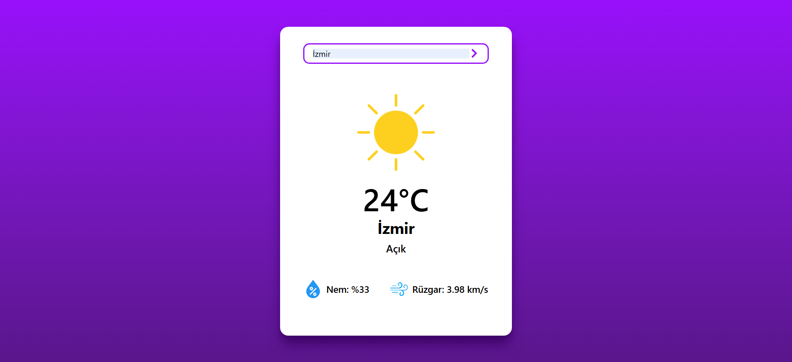
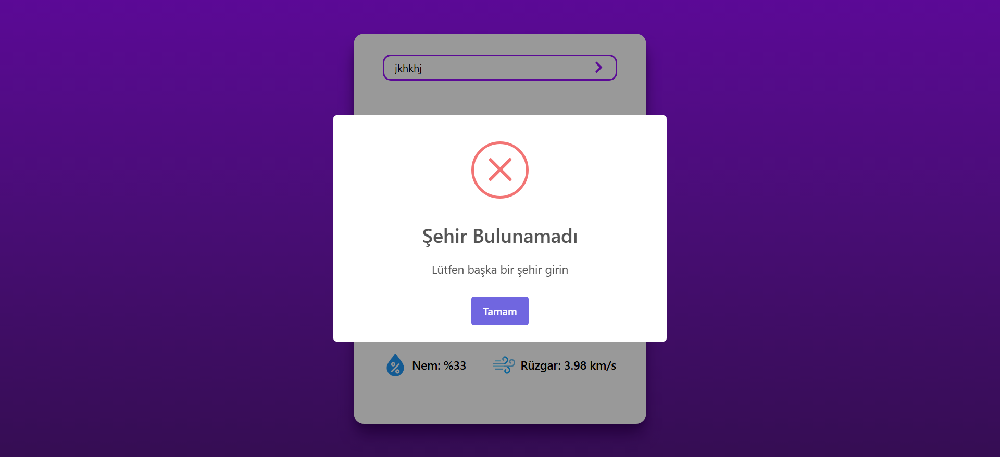
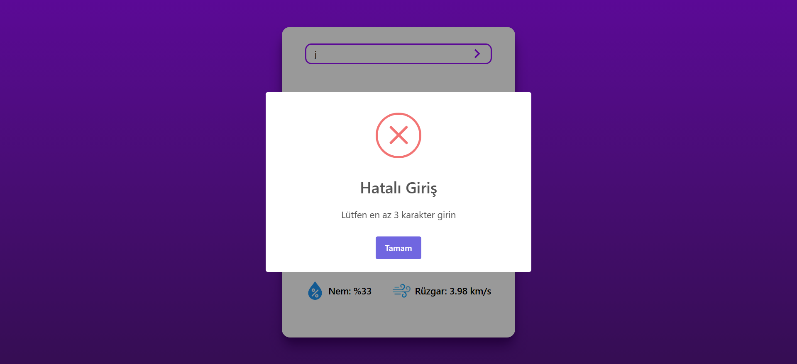

# 🌤️ Weather Website

Bu proje, React, Tailwind CSS ve SweetAlert2 kullanarak geliştirdiğim şık ve işlevsel bir hava durumu uygulamasıdır. Hem kullanıcı dostu hem de sade bir arayüzle, güncel hava koşullarını pratik bir şekilde sunmayı hedefledim.

## 🚀 Proje Özellikleri

- 📍 **Varsayılan Şehir:** Sayfa açıldığında Manisa'nın güncel hava durumu bilgileri otomatik olarak gösterilir.
- 🔎 **Şehir Arama:** Kullanıcı, istediği şehrin ismini girerek o bölgeye ait hava durumu bilgilerini anında görebilir.
- 🌡️ **Detaylı Bilgi:** Sıcaklık, nem oranı ve rüzgar hızı gibi temel meteorolojik veriler kullanıcıya sunulur.
- ⚠️ **Hata Kontrolleri:** Boş giriş, geçersiz şehir adı veya API sorunlarında kullanıcıya anlamlı uyarılar gösterilir.
- 🔐 **API Güvenliği:** OpenWeatherMap API kullanılmış olup, API anahtarı `.env` dosyasına yerleştirilerek güvenli kullanım sağlanmıştır.

## 🛠️ Kullanılan Teknolojiler

- **React** – Bileşen bazlı kullanıcı arayüzü geliştirme.
- **Tailwind CSS** – Modern, sade ve responsive tasarım.
- **SweetAlert2** – Kullanıcıya yönelik etkileyici ve bilgilendirici bildirimler.
- **OpenWeatherMap API** – Güncel hava verilerinin alınması için.

## 📸 Ekran Görüntüleri






## 📦 Kurulum ve Kullanım

Projeyi çalıştırmak için aşağıdaki adımları izleyebilirsiniz:

- **.env dosyası yoksa oluşturun ve kendi API anahtarınızı girin: VITE_API_KEY={YOUR_API_KEY}**
  
```bash
git clone https://github.com/furkan-karapinar/Weather-Website-React.git
cd Weather-Website-React
npm install
npm run dev
```
